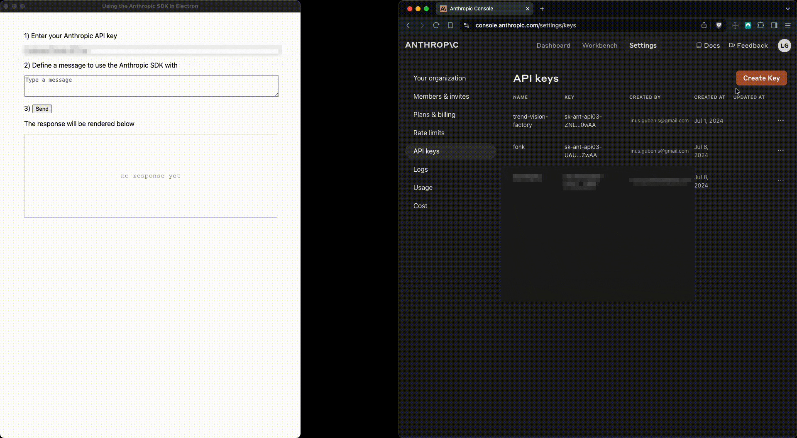

Repository to build a working Electron distributable which includes usage of Anthropic's TypeScript SDK in Electron's node backend

## Environment used to test
- OS: MacOS 14.5
- NodeJS: 18.12.1
- Guide followed: https://www.electronforge.io/#using-templates
- Command to get started: `npm init electron-app@latest my-app -- --template=vite-typescript`

## How to use locally
1) clone this repository to your machine
2) install npm dependencies with `npm install`
3) run `npm run make` to build an executable on your local file-system
4) navigate to the `out` folder after a successful build, you should see an executable electron app
5) execute the built executable and try it out

### important note
you will need a valid Anthropic API key to test the executable
